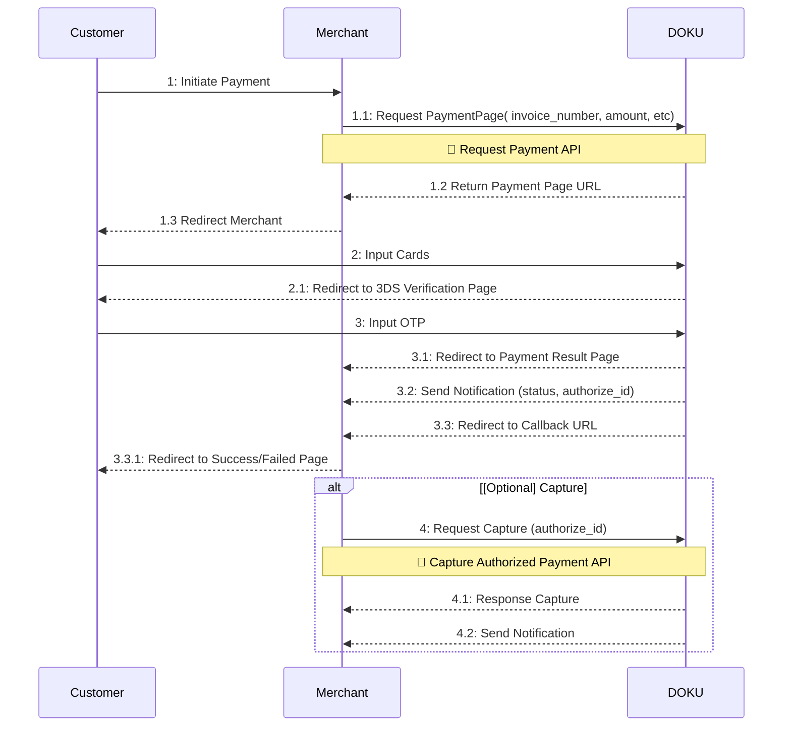
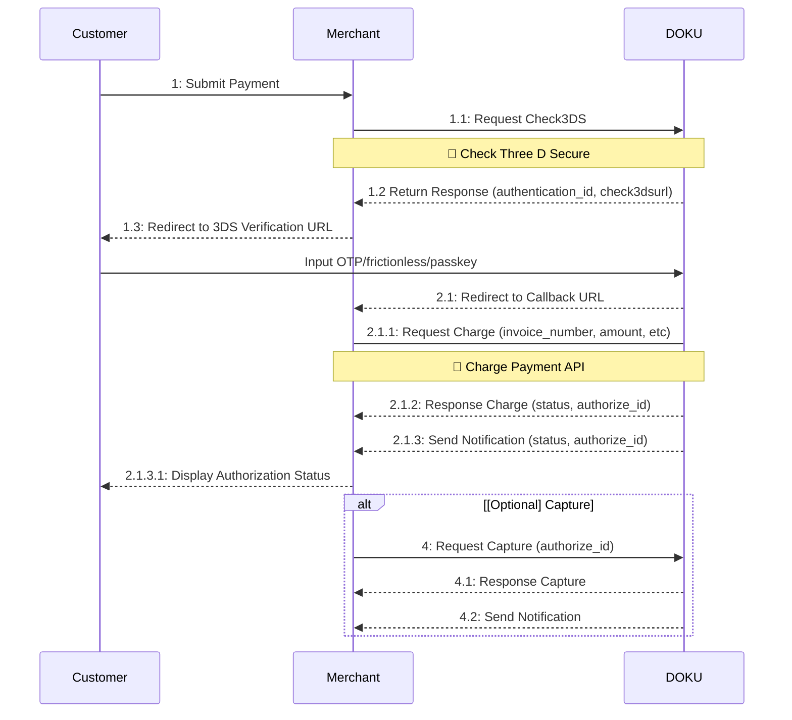
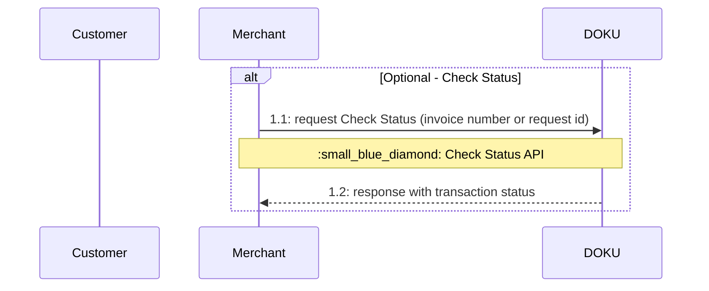
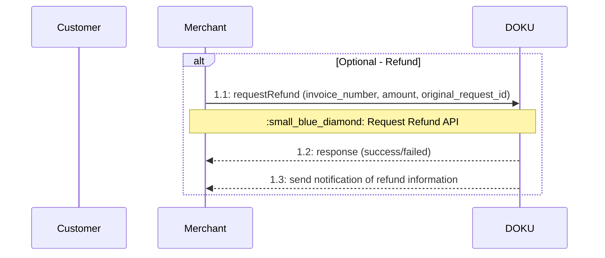

# Overview

By using this Cards, your customers can pay their order with their credit card or any online transaction capable debit card. DOKU has partnered with various banks and principals (Visa, MasterCard) to provide a secure and seamless payment experience for your customers.

If you are a non PCI DSS merchant, you can integrate with our Payment Form, where we will process customer's card information securely for you.

:::warning[Cards API Specifications]
Currently Cards will have a different API Specification with other channels.

In the future, Cards channel will have be included on [Payment API](https://doku-developers.apidog.io/overview-2375704m0.md) so this API will be obsolete
:::

:::highlight purple 💡
**What is PCI DSS?**
The Payment Card Industry Data Security Standard (PCI DSS) is an information security standard for organizations that handle branded credit cards from the major card schemes. The PCI Standard is mandated by the card brands but administered by the Payment Card Industry Security Standards Council.
:::

## Supported Payment Type

| Payment Type | Description |
| --- | --- |
| SALE | This is a single transaction where the authorization (approval of funds) and capture (deduction from the card) happen at the same time. It’s common for retail purchases where funds are immediately processed.|
| MOTO | This is a type of transaction where the card is not physically present, typically used in orders taken over the phone or by mail. Merchants manually enter the card details into the system. |

## Integration Steps
### Merchant Initiate

Here is the overview of how Merchant Initiate payment works:
1. **First Time Payment**
a. Hit the [Request Payment](https://doku-developers.apidog.io/request-payment-42667315e0.md) API
b. Display Payment Page
*Tick save card details to save your card with tokenization.*

2. **Merchant Input Card Credentials and Proceed Payment**
a. DOKU process Payment & return to success/failed page depending on result from processor
b DOKU send HTTP notification including generated token_id which will be used to perform subsequent payment. Learn how to handle the notification from DOKU from [here](https://doku-developers.apidog.io/sample-notification-cards-42667320e0.md).

3. **OPTIONAL** - **Authorize Capture Payment**
a. Merchant hit [Capture Authorized Payment](https://doku-developers.apidog.io/capture-authorized-payment-42667318e0.md) API using authorize_id
b. DOKU return payment status (success/fail)

### Customer Initiate

Here is the overview of how Customer Initiate payment works:
1. **Initiate Payment**
a. Merchant hit the Check 3DS API
b. Return 3DS Page to Customer
c. Customer input OTP on 3DS Page
d. Redirect to Callback URL

2. **Proceed Payment**
a. Merchant hit [Charge Payment](https://doku-developers.apidog.io/charge-payment-42667317e0.md) API.
b. DOKU process Payment & merchant will show their success/failed page depending on result from processor
c. DOKU send HTTP notification including generated token_id which will be used to perform subsequent payment. Learn how to handle the notification from DOKU from [here](https://doku-developers.apidog.io/sample-notification-cards-42667320e0.md).

3. **OPTIONAL** - **Authorize Capture Payment**
a. Merchant hit [Capture Authorized Payment](https://doku-developers.apidog.io/capture-authorized-payment-42667318e0.md) API using authorize_id
b. DOKU return payment status (success/fail)

### Check Status

:::tip[Check Status]
In addition to receiving notifications, you can also retrieve the transaction status by using the Check Status API. Learn how to use Check Status API [here](https://doku-developers.apidog.io/check-status-42667314e0.md).  
:::

:::warning[Token ID on Check Status]
token_id that will be sent within notification can also be received with Check Status API. But keep in note that token_id will be only received when hit Check Status for first time saving card on Success status.
:::

## After Payment
There are several things that you can do after the payment:
a. Refund
b. Unbind Token

### Refund

    
You can request void or refund using [Request Refund](https://doku-developers.apidog.io/request-refund-42667312e0.md) API. 
    
:::info
1. If you are using **Cards Aggregator** service, you can process Void or Refund.
2. If you are using **Cards Direct** service, please consult with your acquiring bank through sales to learn more about whether your credential (MID) supports online refund or not, otherwise refund will be processed manually.
3. Refund can be processed partially and multiple times as long as the total amount from original transaction hasnt been reached
:::

**Refund Status Mapping**
These are the possible response status for Refund API:

| Response | Description |
| --- | --- |
| VOID | If the funds has not settled to your bank account. The refund.amount must equal to order.amount, otherwise will fail |
| PARTIAL_REFUND | If the funds has settled to your bank account, and the refund.amount is less than order.amount
| FULL_REFUND | If the funds has settled to your bank account, and the refund.amount is equal to order.amount

:::tip[Refund Status]
You can also use Check Status API to check is your transaction is already refunded or not. Learn how to use Check Status API [here](https://doku-developers.apidog.io/check-status-42667314e0.md).
:::
    
### Unbind Token
If you want to delete a token that is already saved with tokenization, you can use the Unbind Token API on [this](https://doku-developers.apidog.io/unbind-token-42667313e0.md) page.

## Testing Credentials
These are the Card Credentials that is used for testing purposes on Sandbox Environment.

:::info[Expiry Date and CVV]
For **Expiry Date**, please enter any valid future date in the format MM/YY.

For **CVV**, please enter 100.
:::

Here are the Card Numbers:
| Card Type | Card Number       | Response Code | Description |
|-----------|-------------------|---------------|-------------|
| Master    | 5120910000000012 | 00            | Frictionless |
| Master    | 5120910000000020 | 00            | Challenge |
| Master    | 5120910000000038 | 00            | Non 3DS |
| Master    | 5120910000000046 | 05            | Challenge |
| Master    | 5120910000000053 | 51            | Challenge |
| Master    | 5120910000000129 | 62            | Challenge |
| Visa      | 4509198934905316 | 00            | Frictionless|
| Visa      | 4509198934905324 | 00            | Challenge |
| Visa      | 4509198934905332 | 00            | Non 3DS |
| Visa      | 4509198934905340 | 05            | Challenge |
| Visa      | 4509198934900002 | 51            | Challenge |
| Visa      | 4509198934900010 | 62            | Challenge |

