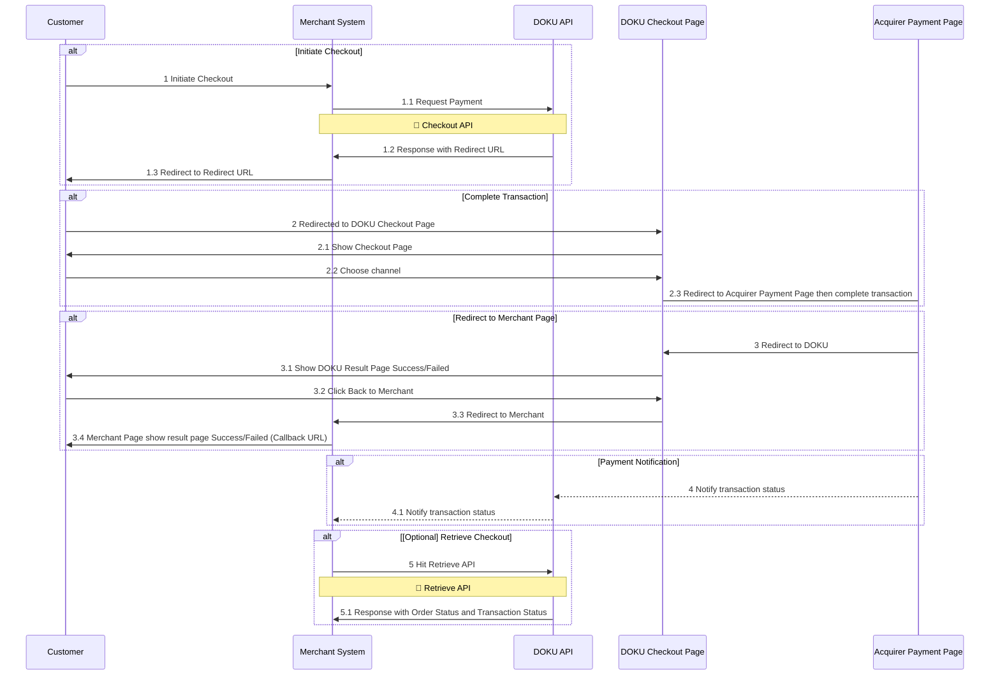

# Overview

Checkout is a payment service that allows you as DOKU merchants to use our payment system, where DOKU's payment page pops up on your website after checkout. This is the easiest and the quickest way to integrate with DOKU without any hassles that suitable for every business needs from small businesses to enterprises.

## Supported Payment Method
| Payment Channel | Payment Method | Value |
| --- | --- | --- |
| FPX | Internet Banking | `INTERNET_BANKING_FPX` |
| Touch 'n Go | E-Wallet | `EWALLET_TNG` |
| GrabPay | E-Wallet | `EWALLET_GRABPAY` |
| ShopeePay | E-Wallet | `EWALLET_SHOPEEPAY` |
| PayLater by Grab | BNPL | `BNPL_GRABPAY` |
| SPayLater | BNPL | `BNPL_SHOPEEPAY` |
| Credit Cards | Cards | `CREDIT_CARD`|
| Atome | BNPL | `BNPL_ATOME` |

## Integration Steps
### Checkout API

Here is the overview of how to Checkout Page works:
1. **Initiate Checkout**
Customer will trigger the Merchant System for Request Payment to the DOKU Checkout API. Additionally, merchants can customize the Checkout by sending several objects and parameter. Learn more [here](https://doku-developers.apidog.io/create-checkout-42667307e0.md).
2. **Complete Transaction**
After get response from DOKU Checkout API, customer will be redirected to DOKU Checkout Page. On DOKU Checkout Page, merchant can see various payment methods and chose one of the method to proceed. Customer will complete the transaction, and the process is based on what payment methods that customer chose. After get the transaction status from acquirer, DOKU will redirect customer to the result page. 

3. **Redirect to Merchant Page**
Given that customer already on DOKU Result Page, they can go to the Merchant Page automatically or by clicking "Back to Merchant" button.

4. **Payment Notification**
DOKU will send HTTP notification to the merchant side. Learn how to handle the notification from DOKU from [here](https://doku-developers.apidog.io/5654146f0.md).

:::warning[Cards Notification]
Currently Cards will have a different notification body since using different API Specification, learn more the Cards Sample Notification [here](https://doku-developers.apidog.io/sample-notification-cards-42667320e0.md).

In the future, Cards channel will have the same specification with other Channels.
:::

:::info[Cards Authorize Capture on Checkout]
For Cards channel with AUTHORIZE type, merchant need to hit [Capture Authorized Payment](https://doku-developers.apidog.io/capture-authorized-payment-42667318e0.md) bring `authorize_id`. Learn more [here](https://doku-developers.apidog.io/overview-2375705m0.md)
:::

5. **[Optional] Retrieve Checkout**
Besides receiving notification, merchant can use Retrieve Checkout API to get the latest order and transaction status. Learn more [here](https://doku-developers.apidog.io/retrieve-checkout-status-42667308e0.md).

