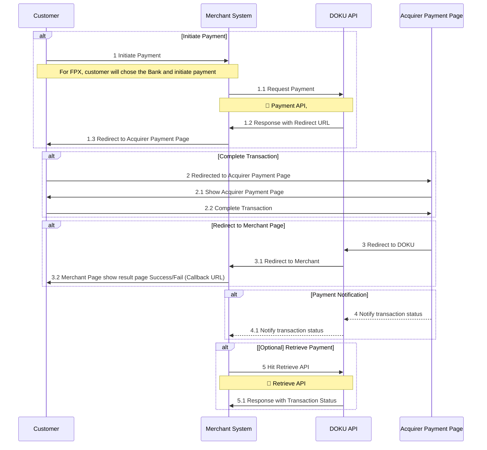
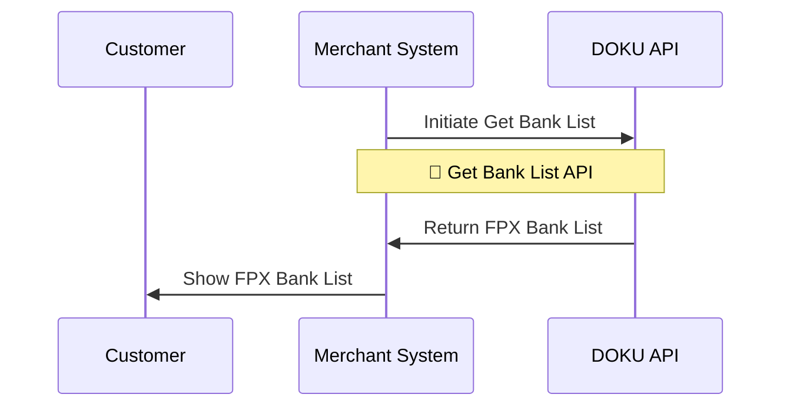

# Overview

The Payment API is a unified direct payment API that supports multiple payment channels through a single endpoint. Merchants specify the desired payment channel in the request payload, allowing full customization of the payment flow and user experience.

## Supported Payment Method
| Payment Channel | Payment Method | Value |
| --- | --- | --- |
| FPX | Internet Banking | `INTERNET_BANKING_FPX` |
| Touch 'n Go | E-Wallet | `EWALLET_TNG` |
| GrabPay | E-Wallet | `EWALLET_GRABPAY` |
| ShopeePay | E-Wallet | `EWALLET_SHOPEEPAY` |
| PayLater by Grab | BNPL | `BNPL_GRABPAY` |
| SPayLater | BNPL | `BNPL_SHOPEEPAY` |
| Atome | BNPL | `BNPL_ATOME` |

:::info[Cards Payment Channel]
Currently Cards channel aren't available on Payment API.

Cards channel will be supported in the future.
:::

## Integration Steps
### Payment API

Here is the overview of how to Payment API works:
1. **Initiate Payment**
Customer will trigger the Merchant System for Request Payment. Additionally, merchants can customize the transaction by sending several objects and parameter. Learn more about Payment API [here](https://doku-developers.apidog.io/create-payment-42667309e0.md). For FPX, merchant must request the Get Bank List API to get the `bank_code` and put it as a request on the Payment API.

2. **Complete Transaction**
After get response from DOKU Payment API, Merchant must handle the response and redirect the customers to acquirer payment page. Customer will complete the transaction on acquirer page, and the process is based on what payment methods that customer chose. 

3. **Redirect to Merchant Page**
Given that customer already complete the transaction, DOKU will redirect your customers to Callback URL that already set on the request.

4. **Payment Notification**
DOKU will send HTTP notification to the merchant side. Learn how to handle the notification from DOKU [here](https://doku-developers.apidog.io/5654146f0.md).

5. **[Optional] Retrieve Payment**
Besides receiving notification, merchant can use Retrieve Payment API to get the latest transaction status. Learn more [here](https://doku-developers.apidog.io/retrieve-payment-status-42667311e0.md).

### Get Bank List - FPX

Get Bank List API will return the `bank_code` of  FPX Banks, either B2C or B2B Banks based on the payment `type` that the merchant request. Learn more about Get Bank List API [here](https://doku-developers.apidog.io/get-bank-list-fpx-42667310e0.md).

:::info[Mandatory for FPX]
This API will be mandatory if you use FPX as a payment method, because on the Payment API you are mandatory to include the `bank_code` if the payment channel is `INTERNET_BANKING_FPX`.
:::

